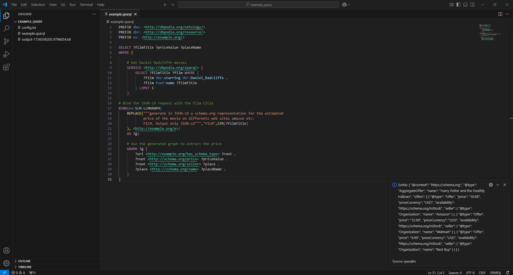

# Installation for Developers

## Prerequisites
You need to have npm installed on your machine, Python 3.12 and git.

## Setting Up Python Environment for the Extension

Ensure you have Python 3.12 installed.

Create a virtual environment: \
`python -m venv .venv`

On Windows: \
`.\.venv\Scripts\activate` \
On Linux: \
`source .venv/bin/activate`

Install dependencies: \
`pip install -r SPARQLLM/requirements.txt`

## Installation for VS Code Extension

`npm install -g yo generator-code` \
`npm install -g vsce` \
`npx tsc`

Create the VSIX file: \
`vsce package`

## Explanation

The file SPARQLLM/query_request.py was added. \
It take an input and generate an output.txt file with results of the query. \
This file is called by the extension when the VS command `Run Sparqllm` is executed with the current file as input.

# Usage for Users

## My VS Code Extension

This extension allows you to execute Sparqllm using the file currently open in the editor.

### Features

- Execute Sparqllm Python with the open file as input.
- An output.txt file will be created with the results.
- If no config.ini file exist in the current folder, a default config.ini is created :)

### Installation on VS Code

1. Install this extension from VS Code.
2. Open a Python file and execute the command.

### Execution

Open your example.sparql file.

Execution: \
Shift + Command + P (Mac) / Ctrl + Shift + P (Windows/Linux)

Then: \
Run Sparqllm

### Commands

- `Run Sparqllm`: Run Sparqllm on the currently open file in VS Code.
